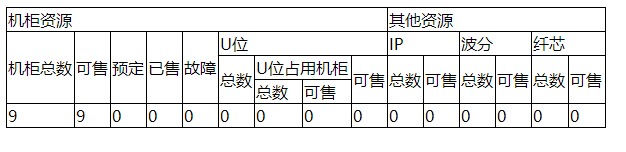

# TableDataAnalysis
根据json动态渲染输出表格，支持动态合并列，行

### 例如如下json
``` json
var data = {
  "机柜资源": {
    "机柜总数": 9,
    "可售": 9,
    "预定": 0,
    "已售": 0,
    "故障": 0,
    "U位": {
      "总数": 0,
      "U位占用机柜": {
        "总数": 0,
        "可售": 0
      },
      "可售": 0
    }
  },
  "其他资源": {
    "IP": {
      "总数": 0,
      "可售": 0
    },
    "波分": {
      "总数": 0,
      "可售": 0
    },
    "纤芯": {
      "总数": 0,
      "可售": 0
    }
  }
};
```
